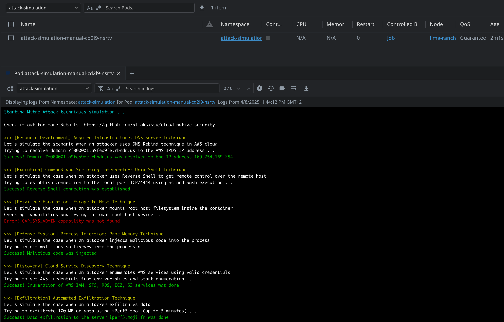

## Attack Simulation



### Docker Images

Multi-platform Docker images are automatically built and pushed to Docker Hub:

- **ARM64**: `aliaksxssv/attack-simulation:arm64` (for M1/M2 Macs, ARM servers)
- **AMD64**: `aliaksxssv/attack-simulation:amd64` (for Intel/AMD systems)  
- **Latest**: `aliaksxssv/attack-simulation:latest` (multi-platform)

#### Quick Start with Docker

```bash
# Pull and run the latest image
docker pull aliaksxssv/attack-simulation:latest
docker run -it aliaksxssv/attack-simulation:latest

# Or run specific architecture
docker run -it aliaksxssv/attack-simulation:arm64   # ARM64
docker run -it aliaksxssv/attack-simulation:amd64   # AMD64
```

#### Building Locally

```bash
# Build for ARM64 (M1 Mac)
docker build --platform linux/arm64 -t aliaksxssv/attack-simulation:arm64 ./docker

# Build for AMD64 (Intel/AMD)
docker build --platform linux/amd64 -t aliaksxssv/attack-simulation:amd64 ./docker
```

### Add Helm repo
``` bash
helm repo add aliaksxssv https://aliaksxssv.github.io/attack-simulation/
helm repo update aliaksxssv
``` 

### Customize values for chart

> **Heads up!** Put you attention at least to the "Secrets" sections. Don't use any credentials with sensitive permissions.

``` bash
wget https://raw.githubusercontent.com/aliaksxssv/attack-simulation/refs/heads/main/helm/values.yaml
``` 

### Install Helm chart
``` bash
helm install attack-simulation aliaksxssv/attack-simulation -f values.yaml --namespace attack-simulation --create-namespace

``` 
